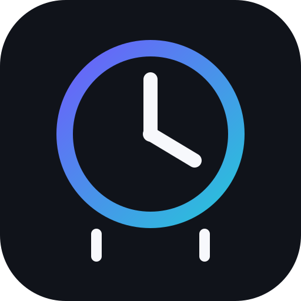
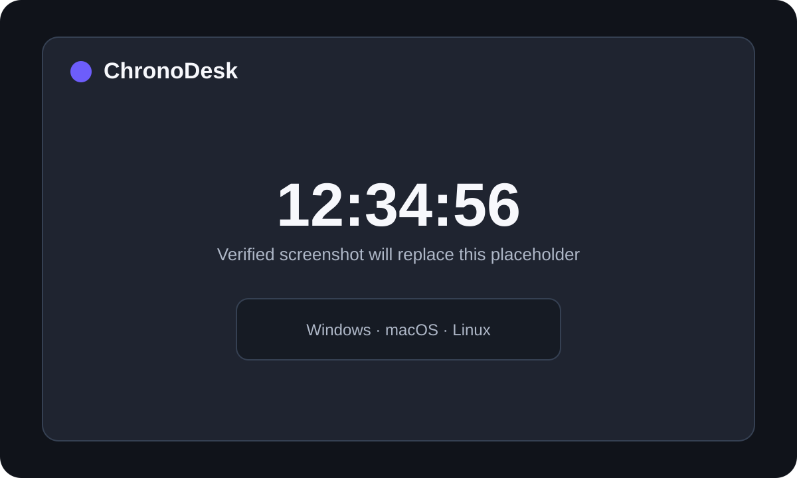

<div align="center">
  

# ChronoDesk

**A focused, private-by-default digital clock and world-clock dashboard for Windows, macOS, and Linux.**

[](https://github.com/sanskarIN/chronodesk/actions/workflows/ci.yml)
[](https://github.com/sanskarIN/chronodesk/actions/workflows/codeql.yml)
[](LICENSE)
[](https://dotnet.microsoft.com/)

[](https://buymeacoffee.com/sanskarIN)

**Made by the Sanskar**
</div>

---

## Why ChronoDesk?

ChronoDesk is intentionally more than a classroom clock demo. It separates clock/timezone logic from UI and platform integration, persists preferences safely, supports multiple world clocks, offers focus and mini modes, respects accessibility preferences, provides optional quiet-hours-aware chimes, and includes the repository quality expected from a serious open-source desktop project.

The application does not require sign-in, analytics, a cloud database, or a network connection for its clock features. Timezone data comes from the operating system, settings stay local, and the product remains fully usable without funding or donations.

## Screenshot

> This image is an explicit placeholder until a release build is captured on a supported desktop. The repository does not pretend that an unverified mockup is a real running-app screenshot.



## Features

### Clock

- 12-hour and 24-hour formats.
- Optional seconds display.
- Date and weekday display.
- ISO week number.
- Optional calendar detail line with day-of-year, ISO week, and UTC offset.
- Configurable clock font family, font size, spacing, theme, and layout.

### World clocks

- Up to 24 local world-clock cards.
- Search the timezone database available through `TimeZoneInfo` on the host OS.
- Portable IANA/Windows timezone-ID conversion fallback where .NET can map an ID.
- Graceful UTC fallback when a persisted timezone is unavailable on the current OS.
- No remote timezone API is required.

### Desktop modes

- **Focus mode:** `F11` full-screen clock.
- **Mini mode:** `Ctrl+M` compact always-on-top clock.
- Configurable normal always-on-top behavior.
- System tray menu with Show, Focus, Mini, and Quit actions where the platform tray implementation is available.
- Optional minimize-to-tray behavior.

### Chimes and quiet hours

- Chimes are opt-in and disabled by default.
- Hourly, half-hourly, and quarter-hourly cadence options.
- Quiet hours can span midnight.
- Duplicate chimes within the same minute are suppressed.
- Playback uses OS-appropriate best-effort system facilities without a remote dependency.

### Accessibility

- Keyboard-first operation and shortcuts.
- High-contrast palette.
- Reduced-motion preference; the application intentionally avoids decorative motion by default.
- Visible native focus behavior from Avalonia/Fluent controls.
- Semantic automation names on key clock/search controls.
- Scalable clock typography and touch-friendly control sizing.
- Non-color-only status text.

### Privacy and reliability

- Local JSON settings only.
- Atomic temporary-file writes before settings replacement.
- Corrupt settings are preserved for manual recovery instead of silently destroyed.
- Import/export is size-bounded and schema-validated.
- Structured JSONL logging with common email/secret-pattern redaction.
- No credentials or API keys are required.
- Startup behavior is opt-in and user-scoped.

## Supported platforms

ChronoDesk targets desktop systems supported by Avalonia and .NET 9:

| Platform | Target | Notes |
|---|---|---|
| Windows | x64 | User-level startup registration through the current-user Run key. |
| macOS | x64 / arm64 | User LaunchAgent startup integration. |
| Linux | x64 | XDG autostart integration; tray/chime behavior can vary by desktop environment. |

Release automation produces self-contained ZIP artifacts for `win-x64`, `linux-x64`, `osx-x64`, and `osx-arm64` when a semantic version tag is pushed.

## Technology stack

- C#
- .NET 9
- Avalonia UI 11
- Fluent theme
- `System.Text.Json`
- xUnit
- GitHub Actions
- GitHub CodeQL
- Dependabot

No database server, web service, authentication provider, telemetry SDK, or cloud account is required.

## Repository layout

```text
chronodesk/
├─ .github/                     # CI, CodeQL, release, Dependabot, templates
├─ docs/                        # Architecture, setup, testing, ADRs, operations
├─ src/
│  ├─ ChronoDesk.Core/          # Domain models, formatting, chime policy, contracts
│  ├─ ChronoDesk.Infrastructure/# JSON persistence, timezone/startup/chime/log adapters
│  └─ ChronoDesk.App/           # Avalonia shell, views, view models, assets
├─ tests/
│  └─ ChronoDesk.Tests/         # Unit/integration-oriented automated tests
├─ ChronoDesk.sln
├─ Directory.Build.props
├─ Directory.Packages.props
└─ what_changed.md              # Primary cross-chat / cross-session handoff
```

See [docs/architecture.md](docs/architecture.md) for the dependency rules and runtime flow.

## Quick start

### Prerequisites

- Git
- .NET 9 SDK
- A supported Windows, macOS, or Linux desktop

### Clone and run

```bash
git clone https://github.com/sanskarIN/chronodesk.git
cd chronodesk
dotnet restore ChronoDesk.sln
dotnet run --project src/ChronoDesk.App/ChronoDesk.App.csproj
```

The first run shows a short onboarding window. No account is created and no remote service is contacted by ChronoDesk itself.

For platform-specific prerequisites and packaging notes, read [docs/setup.md](docs/setup.md).

## Development setup

```bash
dotnet --info
dotnet restore ChronoDesk.sln
dotnet format ChronoDesk.sln --verify-no-changes --no-restore
dotnet build ChronoDesk.sln --configuration Release --no-restore
dotnet test ChronoDesk.sln --configuration Release --no-build
```

Optional development data isolation:

```bash
# PowerShell
$env:CHRONODESK_DATA_DIR = "$PWD/.local-data"

# bash/zsh
export CHRONODESK_DATA_DIR="$PWD/.local-data"
```

`CHRONODESK_DATA_DIR` is the only application-specific environment variable. It is not a secret.

More detail: [docs/development.md](docs/development.md).

## Testing

The current automated suite covers:

- 12/24-hour and seconds formatting.
- ISO week/calendar details.
- overnight quiet-hour boundaries.
- chime cadence and duplicate suppression.
- settings normalization invariants.
- JSON settings round-trip, backup/export/import, and corrupt-file recovery.
- timezone catalog discovery/search/fallback behavior.

Run:

```bash
dotnet test ChronoDesk.sln -c Release --collect:"XPlat Code Coverage"
```

CI runs formatting, build, tests, and NuGet vulnerability checks across Ubuntu, Windows, and macOS. See [docs/testing.md](docs/testing.md).

## Build and publish

Framework-dependent local publish:

```bash
dotnet publish src/ChronoDesk.App/ChronoDesk.App.csproj -c Release
```

Example self-contained Windows x64 publish:

```bash
dotnet publish src/ChronoDesk.App/ChronoDesk.App.csproj \
  -c Release \
  -r win-x64 \
  --self-contained true \
  -p:PublishSingleFile=true \
  -p:IncludeNativeLibrariesForSelfExtract=true
```

Equivalent RIDs used by release automation are `linux-x64`, `osx-x64`, and `osx-arm64`.

Read [docs/release.md](docs/release.md) before creating a release tag.

## Keyboard shortcuts

| Shortcut | Action |
|---|---|
| `F11` | Toggle full-screen focus clock |
| `Ctrl+M` | Toggle mini mode |
| `Ctrl+K` | Focus timezone search |
| `Ctrl+,` | Open Settings |
| `Ctrl+Shift+T` | Toggle normal always-on-top setting |
| `Esc` | Leave focus or mini mode |

## Timezone update strategy

ChronoDesk deliberately does not ship a private or silently downloaded timezone database. `TimeZoneInfo` reads timezone information supplied by the operating system/.NET runtime. This keeps timezone updates aligned with system security/maintenance updates and allows clock features to remain offline.

After the OS timezone database is updated, restart ChronoDesk to rebuild its in-memory timezone catalog. Imported settings can contain Windows or IANA IDs; ChronoDesk attempts the platform mappings exposed by .NET before falling back to UTC for an unavailable ID.

See [docs/architecture.md](docs/architecture.md) and ADR 0003 for the design decision.

## Local data

By default, settings and logs are placed under the user's application-data folder in a `ChronoDesk` directory. The exact base path is resolved through .NET's `Environment.SpecialFolder.ApplicationData` for the current user.

Typical contents:

```text
ChronoDesk/
├─ settings.json
└─ logs/
   └─ chronodesk.log.jsonl
```

If a settings document is malformed, ChronoDesk returns to safe defaults and renames the malformed document with a timestamped `.corrupt-...json` suffix when possible.

For the complete data policy, see [PRIVACY.md](PRIVACY.md).

## Security

ChronoDesk is an offline-first clock, but local desktop software still has a security boundary. The repository therefore uses:

- user-scoped startup integration;
- bounded settings imports;
- safe JSON parsing;
- atomic settings writes;
- restricted external-link schemes;
- redacted structured logs;
- CodeQL;
- dependency review;
- Dependabot;
- CI vulnerability inspection;
- no committed production credentials.

Do not report vulnerabilities in a public issue. Follow [SECURITY.md](SECURITY.md).

## Accessibility

Accessibility is a release criterion rather than a post-release extra. Before a tagged release, manually review keyboard-only use, visible focus, screen-reader naming, contrast, text scaling, reduced-motion behavior, and focus/mini window transitions on each primary platform.

See [docs/accessibility.md](docs/accessibility.md).

## Architecture

ChronoDesk is a modular desktop monolith:

```text
ChronoDesk.App
   ├──> ChronoDesk.Core
   └──> ChronoDesk.Infrastructure ──> ChronoDesk.Core

ChronoDesk.Core ──X──> Avalonia / OS APIs / filesystem
```

`ChronoDesk.Core` owns models and business rules. `ChronoDesk.Infrastructure` implements persistence and platform boundaries. `ChronoDesk.App` owns Avalonia composition and UI behavior. This keeps time/chime/settings logic testable without a desktop session.

Architecture decisions live under [docs/adr](docs/adr/).

## Contributing

Contributions are welcome when they keep ChronoDesk focused, testable, accessible, private by default, and maintainable.

Start with:

1. [CONTRIBUTING.md](CONTRIBUTING.md)
2. [CODE_OF_CONDUCT.md](CODE_OF_CONDUCT.md)
3. [ROADMAP.md](ROADMAP.md)
4. [docs/development.md](docs/development.md)
5. [docs/testing.md](docs/testing.md)

Please keep commits atomic and use Conventional Commits where practical.

Local Git identity requested for this project:

```bash
git config user.name "Sanskar"
git config user.email "sanskarin@outlook.in"
```

## GitHub repository maintenance

The repository includes issue forms, a pull request checklist, dependency automation, CI, CodeQL, dependency review, and release packaging. Recommended branch-protection rules are documented in `docs/github-maintenance.md` so repository settings can match the checks actually present in source control.

## Roadmap

See [ROADMAP.md](ROADMAP.md). The immediate release path is:

- stabilize first public preview;
- capture real per-platform screenshots;
- validate tray and startup behavior on supported desktops;
- expand UI automation/headless coverage;
- tag the first verified release only after the clean-checkout release checklist passes.

## License

ChronoDesk is licensed under the [MIT License](LICENSE).

## Contact and support

- Business: **sanskarin@outlook.in**
- Business: **sanskarin.business@gmail.com**
- Support: **supportramsandesh@gmail.com**
- GitHub: **https://github.com/sanskarIN**
- Repository: **https://github.com/sanskarIN/chronodesk**
- Buy Me a Coffee: **https://buymeacoffee.com/sanskarIN**

For support expectations, read [SUPPORT.md](SUPPORT.md).

---

<div align="center">

[](https://buymeacoffee.com/sanskarIN)

**Made by the Sanskar**

</div>
